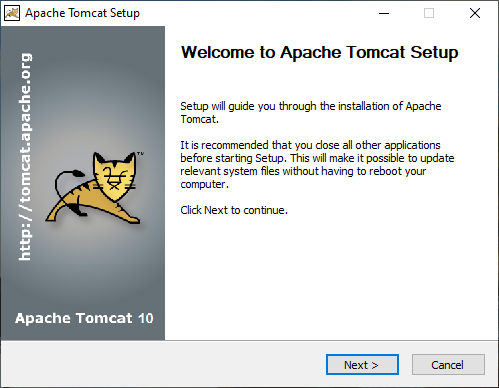
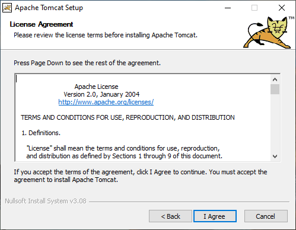
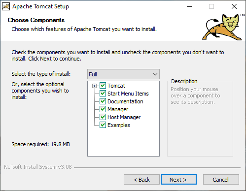
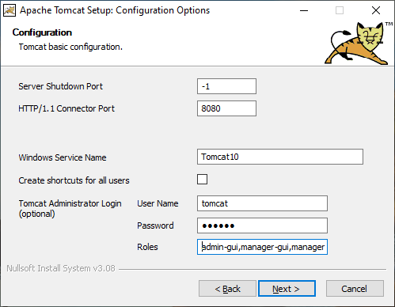
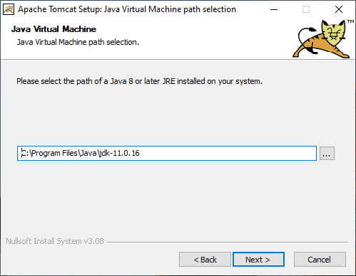
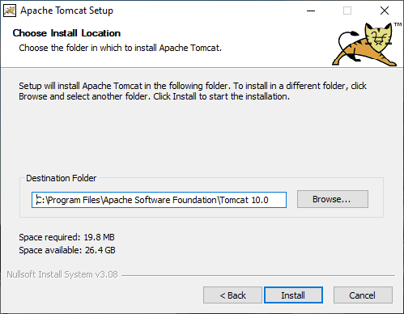
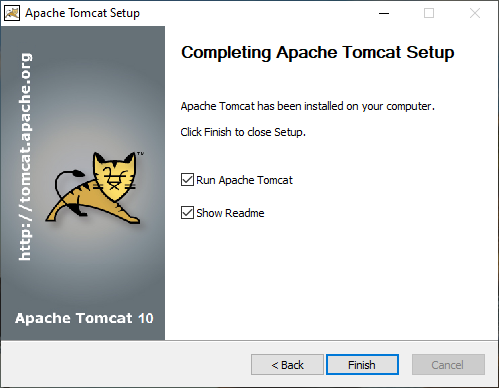

# Instalação do apache Tomcat 10

Este tutorial demonstra como realizar a instalação do Apache Tomcat 10.0 no Windows.É importante lembrar que o **JDK é requisito necessário** para o funcionamento do Tomcat.

1. Na tela inicial de instalação, clique em **Next**.

2. Clique em **I Agree** para prosseguir com a instalação.

3. Na tela de escolha dos componentes, selecione a opção **Full** e clique em **Next**.

4. Matendo as demais configurações padrão, defina o usuário administrador com nome **tomcat** e senha **tomcat**, além dos papéis **admin-gui,manager-gui,manager-script**.

5. Na tela seguinte, localize o **diretório de instalação do JDK**.

6. Clique em **Install** para iniciar a instalação.

7. Após concluir todas as tarefas de instalação, clique em **Finish** para encerrar o processo.

